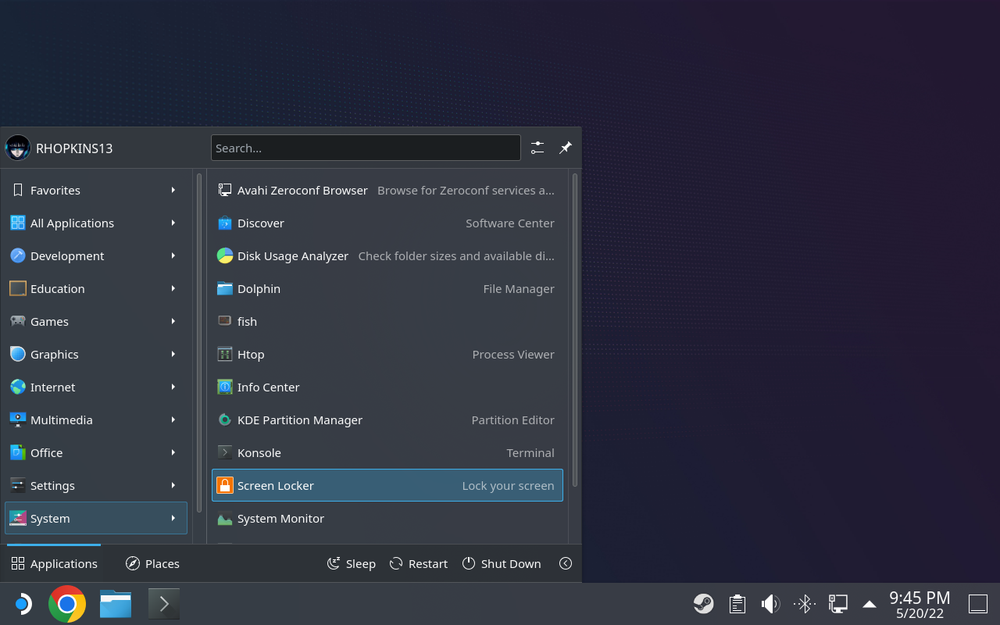
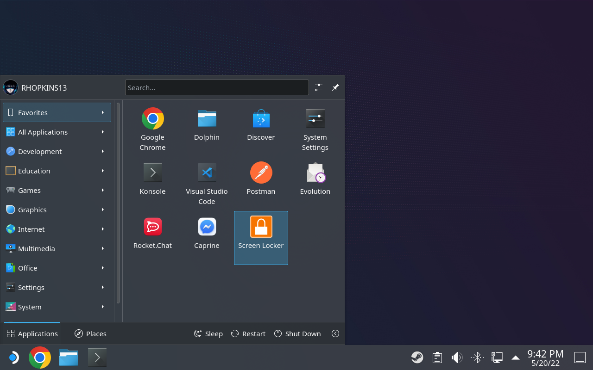
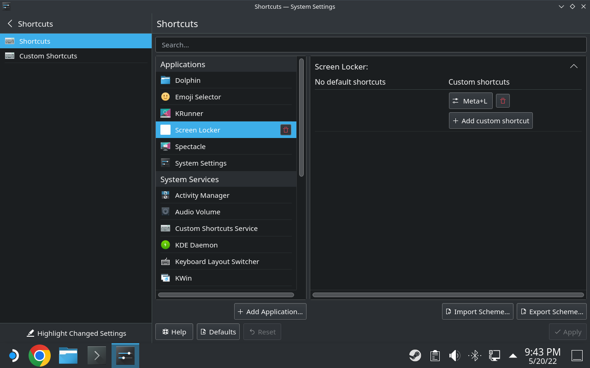

# Steam Deck Screen Lock
How to Enable Screen Lock on Steam Deck's Desktop Mode

I've been using my Steam Deck as a replacement for my ancient laptop, and while using it at work I noticed that there was no lock screen in Desktop Mode. My usual Win+L keyboard shortcut did nothing. I searched online and found that other people were having the same issue. I looked through all of the system settings, and while I was able to find options regarding locking the screen, nothing seemed to allow me to lock the screen on demand.

Interestingly enough, under System Settings -> Workspace Behavior -> Screen Locking, you can set up a timer to automatically lock the screen, and that appears to work fine. So I knew the functionality had to be on there somewhere.

So I enabled SSH, enabled the automatic lock screen and waited for the Steam Deck to lock itself. Then I ssh'd in and saw the command that was being run:
/usr/lib/kscreenlocker_greet --immediateLock

So I made a .desktop file to run the command, and sure enough it seems to work!

# WARNING!
Steam's On-Screen Keyboard doesn't show up on top of the lock screen. If your screen is locked, you will need to use a physical keyboard if you want to unlock it without rebooting!

I'm hoping that Steam eventually releases an update that adds lock screen support for desktop mode. Until then, this workaround works for me. I don't recommend setting up an automatic lock screen timer, you don't want to accidentally get locked out of your Steam Deck while using it as a handheld!

# Setup Instructions
Download the screenlock.desktop file. If you execute it, your screen should lock.

If you want to add it to the Start Menu, copy it to ~/.local/share/applications/ (.local is a hidden folder! You'll have to Show Hidden Files in Dolphin to get there!) Afterwards, it should show up in the Start Menu under Utilities.

If you right-click on it, you can add it to your Favorites for easier access.

Finally, in System Settings you can add a keyboard shortcut to it!

I hope this comes in handy for people!
